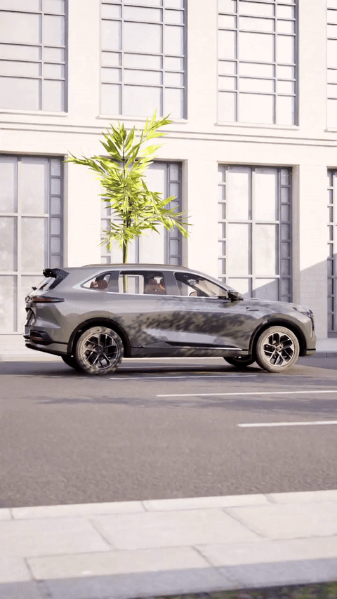
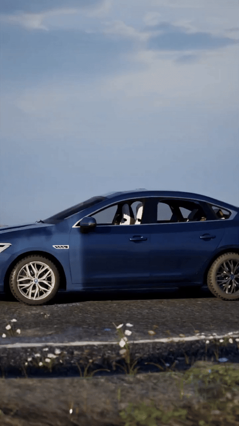
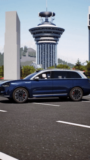
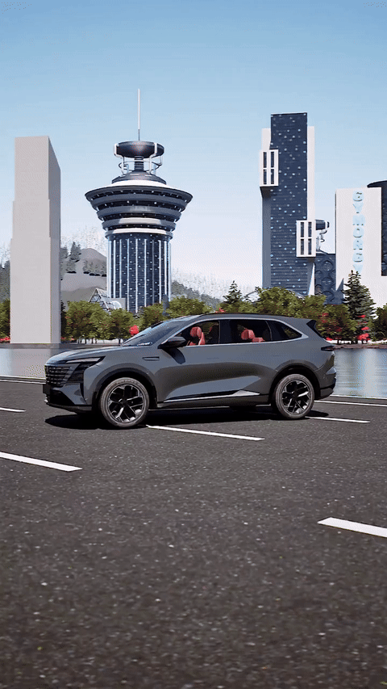
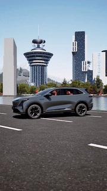
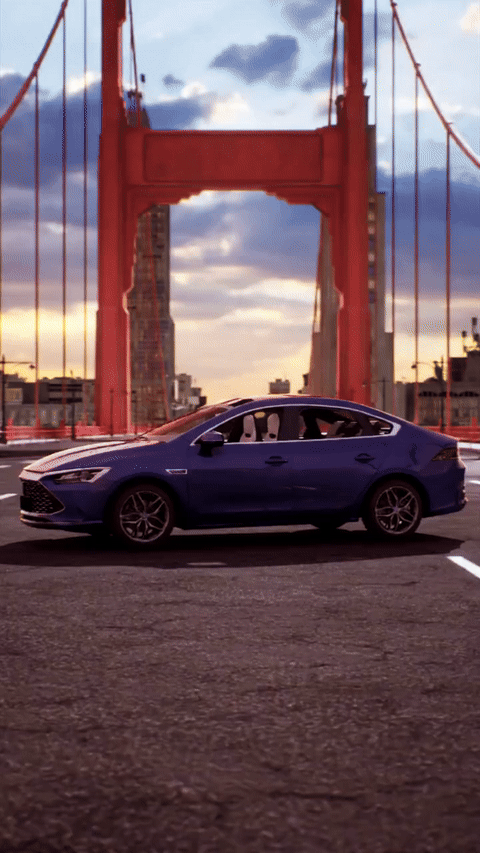
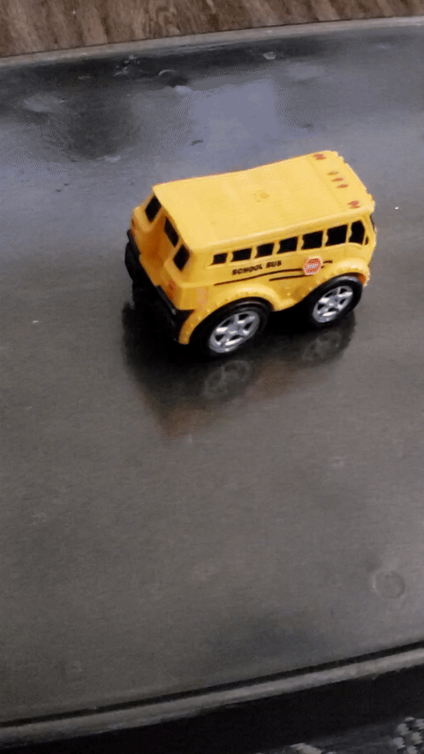

<p align="center">
  <a href="README.md">English</a> | <a href="README_CN.md">中文</a>
</p>

<p align="center">
  <h1 align="center">Implicit Motion Alignment: A Data-Centric Empirical Study for Rigid-Body Video Generation</h1>
  <p align="center">
    <a href="https://github.com/Jklaity"><strong>Jiakang Chen</strong></a>
    ·
    <strong>Shuting Zeng</strong>
  </p>
  <p align="center">
    <a href="https://arxiv.org/abs/xxxx.xxxxx">
      
    </a>
    <a href="https://github.com/Jklaity/Circle-Rotate">
      
    </a>
    <a href="https://huggingface.co/jk1741391802/circle-rotate-lora">
      
    </a>
    <a href="#license">
      
    </a>
  </p>
</p>

<p align="center">
  
</p>

## Highlights

- **81% Subject Drift Reduction**: Compared to baseline methods (4.02 vs. 21.27 pixels/frame)
- **Data-Centric Approach**: No explicit 3D pose supervision required
- **Lightweight Fine-tuning**: Only 0.7% LoRA parameters (100M / 14B)
- **Strong Generalization**: Validated across 5 datasets including CO3D and Mip-NeRF 360

## Abstract

Achieving precise camera control in image-to-video (I2V) generation has traditionally relied on explicit 3D pose supervision (e.g., CameraCtrl), which introduces expensive annotation costs and complex architectural designs. This paper explores a different path: **without any explicit 3D priors, can high-quality data alignment alone enable advanced I2V models to "emerge" rigid-body control capabilities?**

We adopt a minimalist "data-centric" strategy: constructing the **Circle-Rotate** benchmark with 2,168 geometrically aligned videos, and fine-tuning the Wan2.2 I2V model using only lightweight LoRA adapters (0.7% parameter overhead). Our method reduces subject drift by **81%** compared to I2V baselines, while maintaining high-fidelity generation quality.

## News

- **[2025.02.04]** Pre-trained weights released!

## Method Overview

<p align="center">
  
</p>

Our approach consists of two key components:

1. **Circle-Rotate Dataset**: 2,168 professionally produced videos with implicit geometric alignment
2. **Dual-Stage LoRA Fine-tuning**: Frequency-decoupled adaptation for geometry and texture

## Installation

### Prerequisites

This project requires [ComfyUI](https://github.com/comfyanonymous/ComfyUI) for inference. Please install ComfyUI first:

```bash
# Install ComfyUI (see official guide for details)
git clone https://github.com/comfyanonymous/ComfyUI.git
cd ComfyUI
pip install -r requirements.txt
```

For detailed installation instructions, refer to the [ComfyUI Installation Guide](https://docs.comfy.org/get_started/manual_install).

### Clone This Repository

```bash
git clone https://github.com/Jklaity/Circle-Rotate.git
cd Circle-Rotate
pip install -r requirements.txt
```

## Quick Start

### Download Required Models

Download the following models to your ComfyUI `models/` directory:

```
ComfyUI/models/
├── diffusion_models/
│   ├── wan2.2_fun_inpaint_high_noise_14B_fp8_scaled.safetensors
│   └── wan2.2_fun_inpaint_low_noise_14B_fp8_scaled.safetensors
├── loras/
│   ├── wan2.2_i2v_lightx2v_4steps_lora_v1_high_noise.safetensors
│   └── wan2.2_i2v_lightx2v_4steps_lora_v1_low_noise.safetensors
├── vae/
│   └── wan_2.1_vae.safetensors
└── text_encoders/
    └── umt5_xxl_fp8_e4m3fn_scaled.safetensors
```

**Download Links:**

| File | Link |
|------|------|
| wan2.2_fun_inpaint_high_noise_14B_fp8_scaled.safetensors | [Download](https://huggingface.co/Comfy-Org/Wan_2.2_ComfyUI_Repackaged/resolve/main/split_files/diffusion_models/wan2.2_fun_inpaint_high_noise_14B_fp8_scaled.safetensors) |
| wan2.2_fun_inpaint_low_noise_14B_fp8_scaled.safetensors | [Download](https://huggingface.co/Comfy-Org/Wan_2.2_ComfyUI_Repackaged/resolve/main/split_files/diffusion_models/wan2.2_fun_inpaint_low_noise_14B_fp8_scaled.safetensors) |
| wan2.2_i2v_lightx2v_4steps_lora_v1_high_noise.safetensors | [Download](https://huggingface.co/Comfy-Org/Wan_2.2_ComfyUI_Repackaged/resolve/main/split_files/loras/wan2.2_i2v_lightx2v_4steps_lora_v1_high_noise.safetensors) |
| wan2.2_i2v_lightx2v_4steps_lora_v1_low_noise.safetensors | [Download](https://huggingface.co/Comfy-Org/Wan_2.2_ComfyUI_Repackaged/resolve/main/split_files/loras/wan2.2_i2v_lightx2v_4steps_lora_v1_low_noise.safetensors) |
| wan_2.1_vae.safetensors | [Download](https://huggingface.co/Comfy-Org/Wan_2.2_ComfyUI_Repackaged/resolve/main/split_files/vae/wan_2.1_vae.safetensors) |
| umt5_xxl_fp8_e4m3fn_scaled.safetensors | [Download](https://huggingface.co/Comfy-Org/Wan_2.1_ComfyUI_repackaged/resolve/main/split_files/text_encoders/umt5_xxl_fp8_e4m3fn_scaled.safetensors) |

### Download Circle-Rotate LoRA

```bash
huggingface-cli download jk1741391802/circle-rotate-lora --local-dir ./checkpoints
# Copy to ComfyUI loras folder
cp checkpoints/*.safetensors /path/to/ComfyUI/models/loras/
```

### Inference

**Option 1: ComfyUI GUI**

Load `workflow.json` in ComfyUI interface and run.

**Option 2: Command Line**

```bash
# Set ComfyUI path
export COMFYUI_PATH=/path/to/ComfyUI

# Run inference
python inference.py \
    --first_frame examples/first.png \
    --last_frame examples/last.png \
    --prompt "A car, camera smoothly orbits left" \
    --output output.mp4 \
    --lora_high circle_rotate_h.safetensors \
    --lora_low circle_rotate_l.safetensors
```

**Parameters:**
| Parameter | Default | Description |
|-----------|---------|-------------|
| `--cfg` | 1.6 | CFG scale |
| `--steps` | 4 | Inference steps |
| `--width` | 1280 | Video width |
| `--height` | 720 | Video height |
| `--num_frames` | 81 | Number of frames |
| `--lora_strength` | 1.0 | LoRA strength (0.8-1.0 recommended) |

## Circle-Rotate Dataset

<p align="center">
  
</p>

The Circle-Rotate dataset contains **2,168 high-quality videos** with implicit geometric alignment. Each video features smooth circular camera motion around a static subject, providing consistent rigid-body rotation patterns without explicit 3D pose annotations.

Download from HuggingFace: [circle-rotate-dataset](https://huggingface.co/datasets/jk1741391802/circle-rotate-dataset)

## Results

### Visual Comparison

Our method produces **more static subjects** with **less subject drift** compared to baseline methods. The subject remains stable while the camera smoothly rotates around it.

<table width="560">
<tr>
<td width="380" align="center"><b>Others</b></td>
<td width="180" align="center"><b>Ours</b></td>
</tr>
<tr>
<td align="center">
  <table width="360">
    <tr>
      <td align="center"></td>
      <td align="center"></td>
    </tr>
  </table>
</td>
<td align="center"></td>
</tr>
<tr>
<td align="center"></td>
<td align="center"></td>
</tr>
<tr>
<td align="center"></td>
<td align="center"></td>
</tr>
<tr>
<td align="center"></td>
<td align="center"></td>
</tr>
<tr>
<td align="center"></td>
<td align="center"></td>
</tr>
<tr>
<td align="center"></td>
<td align="center"></td>
</tr>
<tr>
<td align="center"></td>
<td align="center"></td>
</tr>
<tr>
<td align="center"></td>
<td align="center"></td>
</tr>
<tr>
<td align="center"></td>
<td align="center"></td>
</tr>
<tr>
<td align="center"></td>
<td align="center"></td>
</tr>
<tr>
<td align="center"></td>
<td align="center"></td>
</tr>
<tr>
<td align="center"></td>
<td align="center"></td>
</tr>
<tr>
<td align="center"></td>
<td align="center"></td>
</tr>
<tr>
<td align="center"></td>
<td align="center"></td>
</tr>
</table>

## Training

We use [musubi-tuner](https://github.com/kohya-ss/musubi-tuner) for LoRA training.

```bash
# Train low-noise LoRA
CUDA_VISIBLE_DEVICES=0 accelerate launch --num_processes 1 \
    src/musubi_tuner/wan_train_network.py \
    --task i2v-A14B \
    --dit models/wan2.2_i2v_low_noise_14B_fp16.safetensors \
    --dataset_config datasets/circle/circle.toml \
    --vae models/Wan2.1_VAE.pth \
    --sdpa --fp8_base \
    --optimizer_type adamw8bit \
    --learning_rate 2e-4 \
    --gradient_checkpointing \
    --gradient_checkpointing_cpu_offload \
    --max_data_loader_n_workers 1 \
    --persistent_data_loader_workers \
    --network_module networks.lora_wan \
    --network_dim 32 \
    --timestep_sampling shift \
    --discrete_flow_shift 8.0 \
    --max_train_epochs 100 \
    --save_every_n_epochs 1 \
    --seed 42 \
    --output_dir ./outputs/low \
    --output_name circle_rotate_l \
    --mixed_precision fp16 \
    --blocks_to_swap 30 \
    --vae_cache_cpu \
    --t5 models/models_t5_umt5-xxl-enc-bf16.pth \
    --sample_prompts prompts.txt \
    --sample_every_n_epochs 1 \
    --sample_at_first
```

```bash
# Train high-noise LoRA
CUDA_VISIBLE_DEVICES=0 accelerate launch --num_processes 1 \
    src/musubi_tuner/wan_train_network.py \
    --task i2v-A14B \
    --dit models/wan2.2_i2v_high_noise_14B_fp16.safetensors \
    --dataset_config datasets/circle/circle.toml \
    --vae models/Wan2.1_VAE.pth \
    --sdpa --fp8_base \
    --optimizer_type adamw8bit \
    --learning_rate 2e-4 \
    --gradient_checkpointing \
    --gradient_checkpointing_cpu_offload \
    --max_data_loader_n_workers 1 \
    --persistent_data_loader_workers \
    --network_module networks.lora_wan \
    --network_dim 32 \
    --timestep_sampling shift \
    --discrete_flow_shift 8.0 \
    --max_train_epochs 100 \
    --save_every_n_epochs 1 \
    --seed 42 \
    --output_dir ./outputs/high \
    --output_name circle_rotate_h \
    --mixed_precision fp16 \
    --blocks_to_swap 30 \
    --vae_cache_cpu \
    --t5 models/models_t5_umt5-xxl-enc-bf16.pth \
    --sample_prompts prompts.txt \
    --sample_every_n_epochs 1 \
    --sample_at_first
```

## Evaluation

Run all metrics at once:

```bash
python scripts/eval_all.py --video path/to/video.mp4 --output results.json
```

**Options:**
- `--num_frames`: Number of frames to sample (default: 16)
- `--no_lpips`: Skip LPIPS calculation
- `--output`: Save results to JSON file

**Metrics included:**
| Metric | Description |
|--------|-------------|
| Subject Drift | Subject position drift using YOLO + SAM |
| CLIP-I | Semantic consistency via CLIP embeddings |
| Fidelity | PSNR, SSIM, LPIPS between first/last frames |
| VBench-SC | Subject consistency using DINO features |
| Motion | Motion magnitude and dynamic degree |

## Acknowledgements

This work builds upon several excellent open-source projects:
- [Wan2.1](https://github.com/Wan-Video/Wan2.1) - Base I2V model
- [musubi-tuner](https://github.com/kohya-ss/musubi-tuner) - LoRA training framework

## License

This project is licensed under the Apache License 2.0 - see the [LICENSE](LICENSE) file for details.
