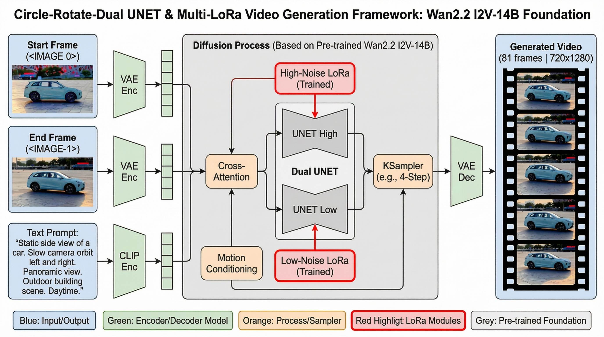
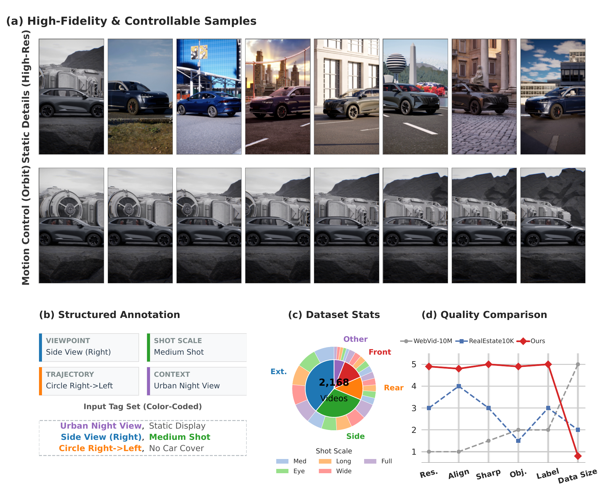
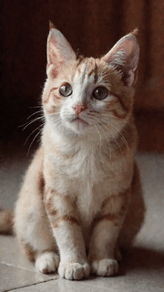
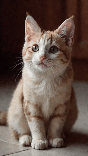

<p align="center">
  <a href="README.md">English</a> | <a href="README_CN.md">中文</a>
</p>

<p align="center">
  <h1 align="center">Implicit Motion Alignment: A Data-Centric Empirical Study for Rigid-Body Video Generation</h1>
  <p align="center">
    <a href="https://github.com/Jklaity"><strong>Jiakang Chen</strong></a>
    ·
    <strong>Shuting Zeng</strong>
  </p>
  <p align="center">
    <a href="https://arxiv.org/abs/xxxx.xxxxx">
      
    </a>
    <a href="https://github.com/Jklaity/Circle-Rotate">
      
    </a>
    <a href="https://huggingface.co/jk1741391802/circle-rotate-lora">
      
    </a>
    <a href="#license">
      
    </a>
  </p>
</p>

<p align="center">
  
</p>

## Highlights

- **81% Subject Drift Reduction**: Compared to baseline methods (4.02 vs. 21.27 pixels/frame)
- **Data-Centric Approach**: No explicit 3D pose supervision required
- **Lightweight Fine-tuning**: Only 0.7% LoRA parameters (100M / 14B)
- **Strong Generalization**: Validated across 5 datasets including CO3D and Mip-NeRF 360

## Abstract

Achieving precise camera control in image-to-video (I2V) generation has traditionally relied on explicit 3D pose supervision (e.g., CameraCtrl), which introduces expensive annotation costs and complex architectural designs. This paper explores a different path: **without any explicit 3D priors, can high-quality data alignment alone enable advanced I2V models to "emerge" rigid-body control capabilities?**

We adopt a minimalist "data-centric" strategy: constructing the **Circle-Rotate** benchmark with 2,168 geometrically aligned videos, and fine-tuning the Wan2.2 I2V model using only lightweight LoRA adapters (0.7% parameter overhead). Our method reduces subject drift by **81%** compared to I2V baselines, while maintaining high-fidelity generation quality.

## News

- **[2025.02.04]** Pre-trained weights released!

## Method Overview

<p align="center">
  
</p>

Our approach consists of two key components:

1. **Circle-Rotate Dataset**: 2,168 professionally produced videos with implicit geometric alignment
2. **Dual-Stage LoRA Fine-tuning**: Frequency-decoupled adaptation for geometry and texture

## Installation

```bash
# Clone the repository
git clone https://github.com/Jklaity/Circle-Rotate.git
cd Circle-Rotate

# Create conda environment
conda create -n circle-rotate python=3.10 -y
conda activate circle-rotate

# Install dependencies
pip install torch torchvision --index-url https://download.pytorch.org/whl/cu118
pip install -r requirements.txt
```

## Quick Start

### Download Pretrained Weights

```bash
# Download LoRA weights from HuggingFace
huggingface-cli download jk1741391802/circle-rotate-lora --local-dir ./checkpoints
```

### Inference

```python
from inference import CircleRotateInference

# Initialize model
model = CircleRotateInference(
    base_model="Wan2.2-I2V-14B",
    lora_high="checkpoints/circle_rotate_h.safetensors",
    lora_low="checkpoints/circle_rotate_l.safetensors"
)

# Generate video from first-last frames
video = model.generate(
    first_frame="examples/first.png",
    last_frame="examples/last.png",
    prompt="A silver sedan, camera smoothly orbits left"
)
```

## Circle-Rotate Dataset

<p align="center">
  
</p>

Download from HuggingFace: [circle-rotate-dataset](https://huggingface.co/datasets/jk1741391802/circle-rotate-dataset)

## Results

### Visual Comparison

<table>
<tr>
<td align="center"><b>Others</b></td>
<td align="center"><b>Ours</b></td>
</tr>
<tr>
<td align="center"></td>
<td align="center"></td>
</tr>
<tr>
<td align="center"></td>
<td align="center"></td>
</tr>
</table>

### More Results

<p align="center">
  
</p>

## Training

We use [musubi-tuner](https://github.com/kohya-ss/musubi-tuner) for LoRA training.

```bash
# Train low-noise LoRA
CUDA_VISIBLE_DEVICES=0 accelerate launch --num_processes 1 \
    src/musubi_tuner/wan_train_network.py \
    --task i2v-A14B \
    --dit models/wan2.2_i2v_low_noise_14B_fp16.safetensors \
    --dataset_config datasets/circle/circle.toml \
    --vae models/Wan2.1_VAE.pth \
    --sdpa --fp8_base \
    --optimizer_type adamw8bit \
    --learning_rate 2e-4 \
    --network_module networks.lora_wan \
    --network_dim 32 \
    --timestep_sampling shift \
    --discrete_flow_shift 8.0 \
    --max_train_epochs 100 \
    --save_every_n_epochs 1 \
    --seed 42 \
    --output_dir ./outputs/low \
    --output_name circle_rotate_l \
    --mixed_precision fp16
```

## Evaluation

```bash
python unified_evaluation.py \
    --metric all \
    --input_dir ./outputs \
    --output results.json
```

## Acknowledgements

This work builds upon several excellent open-source projects:
- [Wan2.1](https://github.com/Wan-Video/Wan2.1) - Base I2V model
- [musubi-tuner](https://github.com/kohya-ss/musubi-tuner) - LoRA training framework

## License

This project is licensed under the Apache License 2.0 - see the [LICENSE](LICENSE) file for details.
